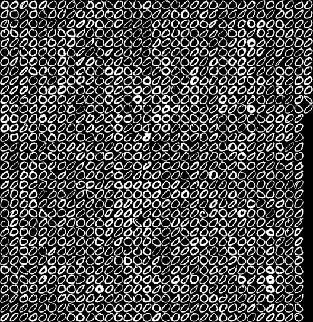
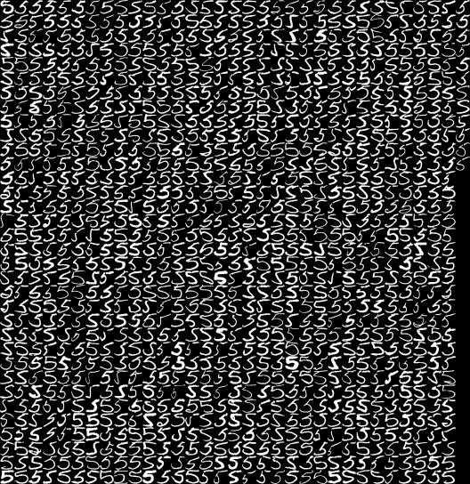
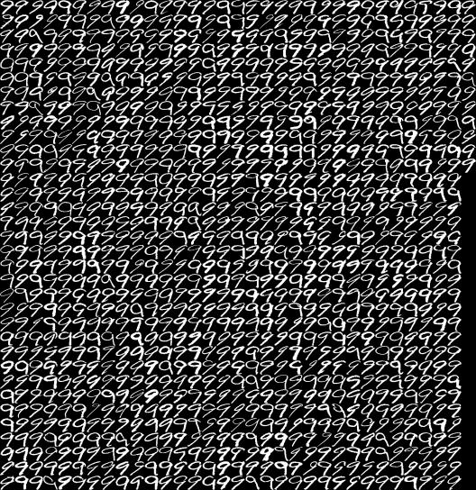

# luacnn

A simple and educational example of using Torch7 convolutional neural networks for handwritten digit recognition on the USPS dataset.

  

*Sample training data: Each image contains 1,100 examples of a digit (33 columns × 34 rows, 16×16 pixels each)* 

## Requirements

* [Torch7](http://www.torch.ch) machine learning library
* `image` torch package
* `qtlua` torch package (optional, for data visualization)

## Development Setup

To set up the git pre-commit hook that automatically formats Lua code with [StyLua](https://github.com/JohnnyMorganz/StyLua):

1. Install StyLua (see [installation guide](https://github.com/JohnnyMorganz/StyLua#installation))
2. Run the setup script: `./setup-hooks.sh`

The pre-commit hook will automatically format any staged Lua files before each commit.

## Getting Started

Simply run the main script:

```bash
th usps_cnn.lua
```

The script will:
1. Load the USPS handwritten digit dataset (10 classes, 16×16 pixel images)
2. Create and train a convolutional neural network
3. Test the network and display classification errors

### Example Output

```
Training the network
----------------------
Index Label Prediction
23    7     9
47    7     1
67    7     9
...
Test error 0.034 ( 34 out of 1000 )
```

*Typical test error: 3-4% (results vary due to stochastic gradient descent)*


## Network Architecture

The CNN processes 16×16 grayscale images through the following layers:

```
Input: 16×16×1 image
    ↓
Convolutional Layer: 6 filters (5×5) → 12×12×6
    ↓
Spatial Sub-Sampling: 2×2 pooling → 6×6×6
    ↓
Reshape to vector: 216 features
    ↓
Tanh activation: bounded to [-1, 1]
    ↓
Fully Connected: 216 → 10 outputs (one per digit)
    ↓
LogSoftMax: log-probabilities for each class
```

### Architecture Details

**Dataset Split:**
- Training: 1,000 samples per digit (10,000 total)
- Testing: 100 samples per digit (1,000 total)

**Layer-by-layer breakdown:**

The first layer of the network is a set of local filters that are applied convolutionally across the image. This is followed by a sub-sampling layer to reduce data dimensionality and introduce a bit of translation invariance. After that, a non-linear transfer function (hyperbolic tangent) keeps the responses bounded to [-1,1]. We then have a linear layer with 10 outputs (one for each digit). Finally, a LogSoftMax operation produces log-probabilities that can be used with the negative log-likelihood criterion.


## Performance

**Classification Results:** Test error typically around **3-4%**

Note that training the network with stochastic gradient descent will give slightly different results each time due to randomness in sample selection during training.

## Possible Improvements

This example was kept intentionally simple for educational purposes. Here are several ways to extend it:

### Speeding up Training

* Normalize data before training
* Use learning rate dependent on number of neurons in layer

### Model Selection

* Use a validation dataset to avoid over-fitting

### Visualization

* Show current error during training
* Display wrongly classified examples at test time

### Multi-task Learning

* Jointly train multiple networks (e.g., one for digits and another for letters)
* Share first layer parameters between networks using Torch's `clone` and `share` methods  


## Credits

**Author:** Hugo Penedones

**Mentors/Collaborators:** David Grangier, Ronan Collobert
*(During 2010 Summer internship at NEC Labs, Princeton, US and at Idiap Research Institute, Switzerland)*

## Recommended Reading

Y. LeCun, L. Bottou, G. Orr and K. Muller: **Efficient BackProp**, in Orr, G. and Muller K. (Eds), *Neural Networks: Tricks of the trade*, Springer, 1998

---

*This project demonstrates a simple but effective approach to handwritten digit recognition using convolutional neural networks with Torch7.*


